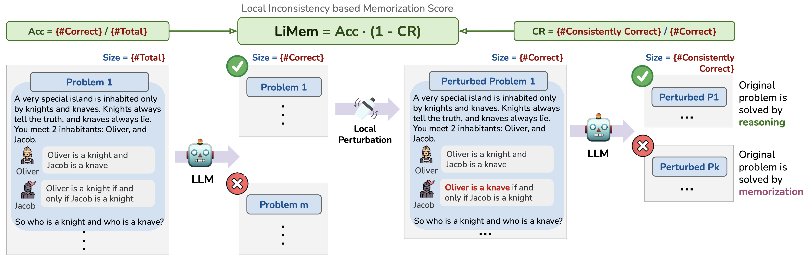

<h1 align="center">On Memorization of Large Language Models in Logical Reasoning</h1>

<p align="center">
<a href="https://arxiv.org/abs/2410.23123">📃 Paper</a>
•
<a href="https://huggingface.co/datasets/K-and-K/knights-and-knaves/" > Data</a>
•
<a href="https://huggingface.co/datasets/K-and-K/perturbed-knights-and-knaves/" > Perturbed Data</a>
•
<a href="https://memkklogic.github.io/" >Project Page</a>
</p>


This repository provides the PyTorch implementation of the paper "On Memorization of Large Language Models in Logical Reasoning".

Introduction: In this work, we investigate memorization of LLMs in reasoning tasks.
- We propose a memorizatioin metric for reasoning tasks and a dynamically generated logical reasoning benchmark based on Knights and Knaves (K&K) puzzles.
- LLMs could achieve high training accuracy after fine-tuning, yet fail when those puzzles are slightly perturbed, suggesting that the models heavily rely on memorization to solve those training puzzles.
- On the other hand, fine-tuning also consistently improves generalization performance. In-depth analyses with perturbation tests, cross difficulty-level transferability, probing model internals, and fine-tuning with wrong answers suggest that the LLMs learn to reason on K&K puzzles despite training data memorization.
- Finally, we use puzzle-based indicators and model-based indicators to classify puzzles solved by reasoning v.s. memorization.

<p align="center">
  
</p>


## Updates 
* `10/31/2024`: Code, <a href="https://huggingface.co/datasets/K-and-K/knights-and-knaves/">data</a>, <a href="https://arxiv.org/abs/2410.23123">ArXiv article</a> and <a href="https://memkklogic.github.io/">project page</a> are available.


## 🛠️ Installation

```bash
conda env create -f environment.yml
conda activate kk
```

## 📝 Synthetic data

<p align="center">
  
</p>

### Option 1: use HF dataset 

When using our code for evaluation / fine-tuning, we import the datasets from huggingface:

```python
import datasets
datasets.load_dataset('K-and-K/knights-and-knaves', 'test')
datasets.load_dataset('K-and-K/perturbed-knights-and-knaves', 'test')
```

### Option 2: generate data locally
To generate K&K data for {2,3,4,5,6,7,8}-people puzzles with a train/test split, run:

```bash
python data_prep/data_gen_kk.py
```

Locally perturbed data will also be generated. The generated data will be stored in the `data` directory. 

In addition, you can use it to generate wrong answer data and wrong CoT data (including one wrong step and shuffuled CoT steps).


## 🤖 Evaluation

Some general evaluation parameters:
| Argument                | Example                        | Description                                                                                             |
|-------------------------|--------------------------------|---------------------------------------------------------------------------------------------------------|
| `--max_token`           | `2048`                         | Maximum number of tokens.                                                                               |
| `--split`               | `train`, `test`                | Choose the data split for evaluation.                                                                   |
| `--limit`               | `100`                          | Limit the number of evaluation samples.                                                                 |
| `--ntrain`              | `0`, `1`                       | Number of demonstrations for 0-shot/few-shot prompting.                                                        |
| `--problem_type`        | `clean`, `perturbed_statement`, `perturbed_leaf`, `random_pair`, `reorder_statement`, `uncommon_name`, `flip_role` | Type of problem, supporting various perturbations.                                                      |
| `--eval_nppl`           | `2`,`3`,`4`,`5`,`6`,`7`,`8`              | Number of people in K&K puzzles.  If not set, it will evaluate all n-ppl tasks.                                    |
| `--vllm`                | `true`                         | Enable VLLM for faster inference for open-source models.                                                                       |
| `--model`               | `openai/gpt-4o-mini-2024-07-18` | The model to be evaluated. We support open-source and closed-sourced models.                            |


### Evaluation on test samples

For each K&K task, evaluate all test samples (100 samples).

Evaluate on test samples under 1/0-shot & with/without CoT by running:

```bash
bash scripts/eval/run_test.sh
```

Evaluate under 0-shot & without CoT on 2 math-level perturbation types (`perturbed_statement`, `perturbed_leaf`):

```bash
bash scripts/eval/eval_test_pertub.sh
```

### Evaluation on training samples
After fine-tuning the models following `## 4. Fine-Tuning`, we evaluate on training samples.
We evaluate the first 100 samples for the fine-tuned GPT-4o-mini, and all samples for open-source models.

Evaluate under 0-shot & without CoT

```bash
bash scripts/eval/eval_train.sh
```

Evaluation on Perturbed Training Samples: 

Evaluate under 0-shot & without CoT on 6 perturbation types (`perturbed_statement`, `perturbed_leaf` `random_pair`, `reorder_statement`, `uncommon_name`, `flip_role`):

```bash
bash scripts/eval/eval_train_pertub.sh
```

#### Evaluation on closed-sourced models

Provide API keys:
```bash
export OPENAI_API_KEY='your-api-key-here'
export ANTHROPIC_API_KEY='your-api-key-here'
```

Example usages for OpenAI/Anthropic models with direct prompting:
```bash
bash scripts/eval/gpt4omini_direct.sh
bash scripts/eval/claude-sonet.sh
```

Evaluate with cot prompting:
```bash
bash scripts/eval/gpt4omini_cot.sh
```

## 🚗  Fine-tuning


### Direct fine-tune

To fine-tune the model directly on answers (without CoT), run:

```bash
bash scripts/ft/ft_lm3.sh
```

### CoT fine-tune

To fine-tune the model with CoT, run:

```bash
bash scripts/ft/ft_lm3_cot.sh

```
You can change the saved model path `output_dir` in the above scripts.

#### Merge fine-tuned adapter and base model

Load the saved adapter from fine-tuning, as well as the base model, then save the merged model by running:

```bash
bash scripts/ft/merge_adapter.sh
```

Make sure to change the model paths `base_model_path`, `adapter_path`,  `base_model_path` in the script as needed. 

#### Fine-tune closed-sourced models
For closed-sourced models,  we follow the [OpenAI finetuning API](https://platform.openai.com/docs/guides/fine-tuning) to finetune GPT-4o-mini. 


## 🔍 Probe

To probe the model's internal representations, update the model paths and the number of ppl in the puzzles for evaluation in the script: 
```bash
bash scripts/probe/run.sh
```


## 🗃️ Sample classification
Here we classify on consistenly solved v.s. non consistenly solved puzzles.

Update the model paths and provide data with binary label of consistenly solved v.s. non consistenly solved for each training sample, and then run the following:

Classification with puzzled-based indicators:

```bash
bash scripts/mem_classify/model_indicator.sh
```

Classification with model-bases indicators:

```bash
bash scripts/mem_classify/puzzle_indicator.sh
```

## 📚 Citation
If you find our work helpful, please consider citing it as follows:
```bibtex
@article{xie2024memorization,
title={On Memorization of Large Language Models in Logical Reasoning}, 
author={Chulin Xie and Yangsibo Huang and Chiyuan Zhang and Da Yu and Xinyun Chen and Bill Yuchen Lin and Bo Li and Badih Ghazi and Ravi Kumar},
year={2024},
eprint={2410.23123},
archivePrefix={arXiv},
primaryClass={cs.CL},
url={https://arxiv.org/abs/2410.23123}, 
}
```


## 📖 Questions
Please reach out to us if you have any suggestions or need any help in reproducing the results. You can submit an issue or pull request, or send an email to chulinx2@illinois.edu.
