# Reinforcement Learning Research Repo

## Eliciting Reflection in LLMs with RL

We first experiment with eliciting reflection in LLMs directly with reinforcement learning. Following the setup of [Logic-RL](https://github.com/Unakar/Logic-RL), we chose knights and knaves (KK) dataset. We run GRPO algorithm on the 5-person configuration of the kk dataset (800 entries) for 380 steps.


**Some Differences:**
- **Logic-RL**: Uses curriculum learning across 2-7 person configurations with REINFORCE++ (a variant of Policy Gradient)
- **Our Approach**: Trains exclusively on 5-person configuration (1/6 of data) with GRPO algorithm (yet another variant of Policy Gradient). We can optionally train 40 steps on 7-person configuration to reach SOTA performance.

---
### Result

#### Benchmark
---
| **Model**                                                             | **Avg** | **2ppl** | **3ppl** | **4ppl** | **5ppl** | **6ppl** | **7ppl** | **8ppl** |
|-----------------------------------------------------------------------|---------|----------|----------|----------|----------|----------|----------|----------|
| **o3-mini-high**                                                          | **0.94** | 0.99     | 0.98     | 0.97     | 0.95     | 0.94     | 0.89     | 0.83     |
| o1-2024-12-17                                                         | 0.42    | 0.83     | 0.51     | 0.38     | 0.38     | 0.35     | 0.30     | 0.20     |
| GPT-4o                                                                | 0.37    | 0.68     | 0.57     | 0.49     | 0.32     | 0.23     | 0.21     | 0.11     |
| Deepseek-Math-7b                                                      | 0.10    | 0.35     | 0.21     | 0.08     | 0.06     | 0.02     | 0.00     | 0.00     |
| **Qwen2.5-7B-Logic-RL (Reinforce++)**                                  | **0.89** | 0.99     | 0.99     | 0.94     | 0.92     | 0.91     | 0.80     | 0.67     |
| Qwen2.5-7B-Instruct-1M                                                | 0.26    | 0.64     | 0.39     | 0.33     | 0.21     | 0.13     | 0.03     | 0.08     |
| DeepSeek-R1-Distill-Qwen-32B                                          | 0.83    | 0.97     | 0.96     | 0.97     | 0.84     | 0.72     | 0.70     | 0.67     |
| **Qwen2.5-7B-GRPO (ours; step 380)**                                  | 0.89 | 0.93     | 0.98     | 0.99     | 0.98     | 0.84     | 0.85     | 0.67     |
| **Qwen2.5-7B-GRPO (ours; step 420)**                                  | **0.92** | 0.93     | 0.98     | 1.00     | 0.98     | 0.90     | 0.85     | 0.79     |


*Note: first 5 results are from [Logic-RL](https://github.com/Unakar/Logic-RL). The last 4 are from our experiments.*

---

#### Training Dynamics

<p float="left">
  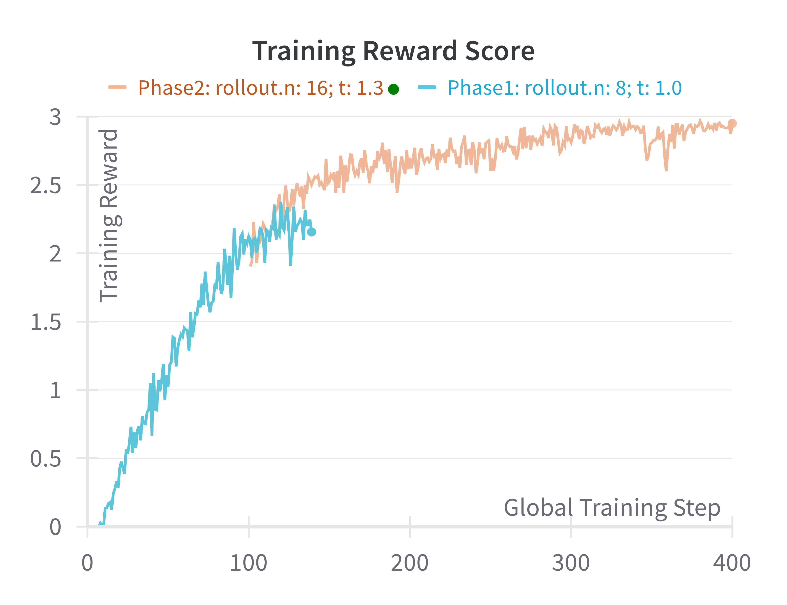
  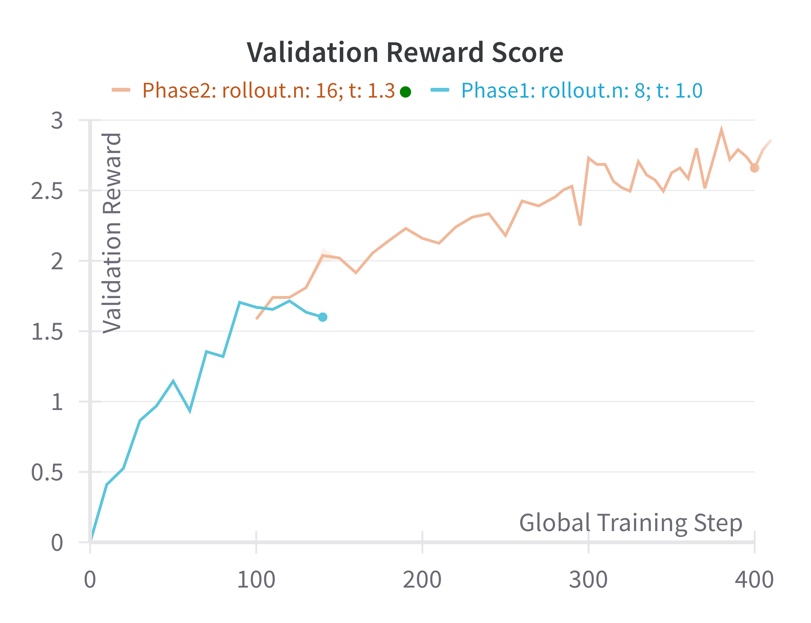 
  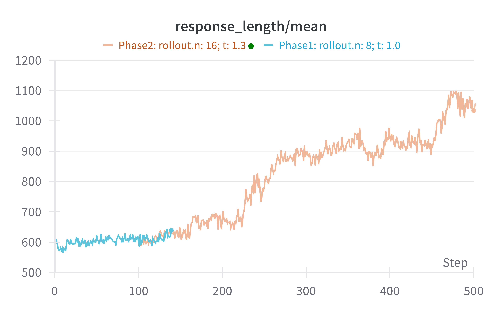
</p>

---

#### Aha Moment (different from R1!)
**Highlight**  
> Therefore, we need to re-evaluate our assumptions.
> Let's try a different approach one more time

<details>

<summary>Complete reasoning trace</summary>

```
<think> To solve this, let's analyze each statement step by step, considering the implications based on whether the speakers are knights (who always tell the truth) or knaves (who always lie).

1. Sofia says: "Mia is a knave or Aiden is a knight."
2. Scarlett says: "Sofia is a knight or Grace is a knave."
3. Mia says: "Aiden is not a knight."
4. Aiden says: "Scarlett is not a knight."
5. Grace says: "Mia is a knave and Mia is a knight."

Let's start by analyzing Grace's statement. Since Grace says "Mia is a knave and Mia is a knight," this statement is inherently contradictory. Therefore, Grace must be a knave (since a knave always lies).

Now that we know Grace is a knave, let's look at Scarlett's statement: "Sofia is a knight or Grace is a knave." Since Grace is a knave, Scarlett's statement is true, which means Scarlett must be a knight.

Next, let's consider Aiden's statement: "Scarlett is not a knight." Since we've determined that Scarlett is a knight, Aiden's statement is false, which means Aiden must be a knave.

Now we know Aiden is a knave, let's look at Sofia's statement: "Mia is a knave or Aiden is a knight." Since Aiden is a knave, the statement "Aiden is a knight" is false. Therefore, for Sofia's statement to be true (and since Sofia is a knight), "Mia is a knave" must be true. This means Mia is a knave.

Finally, let's check Mia's statement: "Aiden is not a knight." Since Aiden is a knave, Mia's statement is true, which means Mia must be a knight. However, we've already determined that Mia is a knave, which creates a contradiction. This contradiction suggests that our initial assumption about Aiden being a knave might be incorrect.

Let's try a different approach by assuming Aiden is a knight. If Aiden is a knight, then his statement "Scarlett is not a knight" must be true, meaning Scarlett is a knave. If Scarlett is a knave, then her statement "Sofia is a knight or Grace is a knave" must be false. For the statement to be false, both "Sofia is a knight" and "Grace is a knave" must be false. This means Sofia is a knave and Grace is a knight.

If Sofia is a knave, then her statement "Mia is a knave or Aiden is a knight" must be false. For the statement to be false, both "Mia is a knave" and "Aiden is a knight" must be false. This means Mia is a knight and Aiden is a knave, but we already assumed Aiden is a knight, which creates a contradiction. Therefore, our assumption that Aiden is a knight is incorrect.

Let's try a different approach again, assuming Sofia is a knight. If Sofia is a knight, then her statement "Mia is a knave or Aiden is a knight" must be true. This means either Mia is a knave or Aiden is a knight (or both).

Let's assume Aiden is a knave. If Aiden is a knave, then his statement "Scarlett is not a knight" is false, meaning Scarlett is a knight. If Scarlett is a knight, then her statement "Sofia is a knight or Grace is a knave" must be true. Since Sofia is a knight, the statement is true, which means Scarlett is a knight.

Now, let's check Mia's statement: "Aiden is not a knight." Since Aiden is a knave, Mia's statement is true, which means Mia must be a knight.

Finally, let's check Grace's statement: "Mia is a knave and Mia is a knight." Since Mia is a knight, Grace's statement is false, which means Grace must be a knave.

Now, let's check Sofia's statement again: "Mia is a knave or Aiden is a knight." Since Mia is a knight and Aiden is a knave, Sofia's statement is false, which means Sofia must be a knave. However, we initially assumed Sofia is a knight, which creates a contradiction. Therefore, we need to re-evaluate our assumptions.

Let's try a different approach one more time, assuming Sofia is a knave. If Sofia is a knave, then her statement "Mia is a knave or Aiden is a knight" is false. This means Mia is a knight and Aiden is a knave.

If Aiden is a knave, then his statement "Scarlett is not a knight" is false, meaning Scarlett is a knight. If Scarlett is a knight, then her statement "Sofia is a knight or Grace is a knave" must be true. Since Sofia is a knave, the statement is true, which means Scarlett is a knight.

Now, let's check Mia's statement: "Aiden is not a knight." Since Aiden is a knave, Mia's statement is true, which means Mia must be a knight.

Finally, let's check Grace's statement: "Mia is a knave and Mia is a knight." Since Mia is a knight, Grace's statement is false, which means Grace must be a knave.

Now, let's check Sofia's statement again: "Mia is a knave or Aiden is a knight." Since Mia is a knight and Aiden is a knave, Sofia's statement is false, which means Sofia must be a knave.

This configuration is consistent with all the statements. Therefore, the identities are:
Sofia is a knave
Scarlett is a knight
Mia is a knight
Aiden is a knave
Grace is a knave
</think>
<answer> (1) Sofia is a knave
(2) Scarlett is a knight
(3) Mia is a knight
(4) Aiden is a knave
(5) Grace is a knave 
</answer>
```

</details>

---

### Reproduction Instructions

#### Setup
1. Obtain model and dataset:
    1. Obtain `Qwen/Qwen2.5-7B-Instruct-1M` and place it in:  
    `experiments/models/Qwen2.5-7B-Instruct-1M`
    2. Download the knights-and-knaves dataset from [HF Datasets](https://huggingface.co/datasets/K-and-K/knights-and-knaves) and place it in:  
    `experiments/raw/knights-and-knaves`

2. Create environment:
   ```bash
   conda create -n verl python==3.9
   conda activate verl
   pip3 install torch==2.4.0 --index-url https://download.pytorch.org/whl/cu124
   pip3 install flash-attn --no-build-isolation
   git clone https://github.com/volcengine/verl.git
   cd verl && pip3 install -e .
   ```

#### Preprocessing
```bash
cd experiments
python ../verl/examples/data_preprocess/kk.py \
  --local_dir ./dataset/kk/instruct/5ppl \
  --data_path ./raw/knights-and-knaves/train/people5_num1000.jsonl
```

#### Training
**Phase 1 (For 100 steps):**  
*Parameters: rollout.n=8, rollout.temperature=1.0*
```bash
bash run_logicRL_4gpus_phase1.sh
```

**Phase 2 (Additional 280 steps):**  
*Parameters updated: rollout.n=16, rollout.temperature=1.3*
```bash
bash run_logicRL_4gpus_phase2.sh
```

You can modify the script to train additional steps on more data to reach better performance.

### Evaluation
```bash
python ../verl/scripts/model_merger.py --local_dir ./checkpoints/logic_rl/grpo_run/global_step_380/actor/

bash ../evaluation/kk/scripts/eval/eval_grpo.sh
```


## Eliciting Reflection in small LMs with Distillation followed by RL

It was discussed in a lot of literature that it was hard to perform R1-Zero like RL on small LMs. Distillation (imitation learning) was considered as a viable alternative. To this end, we reproduce the success of R1-Distill series models on the knights and knaves dataset.

### Unfruitful attemp: Direct RL on Qwen2.5-1.5B-Insturct

We first attempted to train Qwen2.5-1.5B-Instruct model with GRPO algorithm. However, despite our best efforts to tune the hyperparameters, the model collapsed. 

For our run with temperature `t=1.0`, the model converged to a policy kept putting dummy message like `"this is thinking process"` inside the `<think></think>` block. This behavior is also reported in many reproductions of R1-Zero.

<p float="left">
  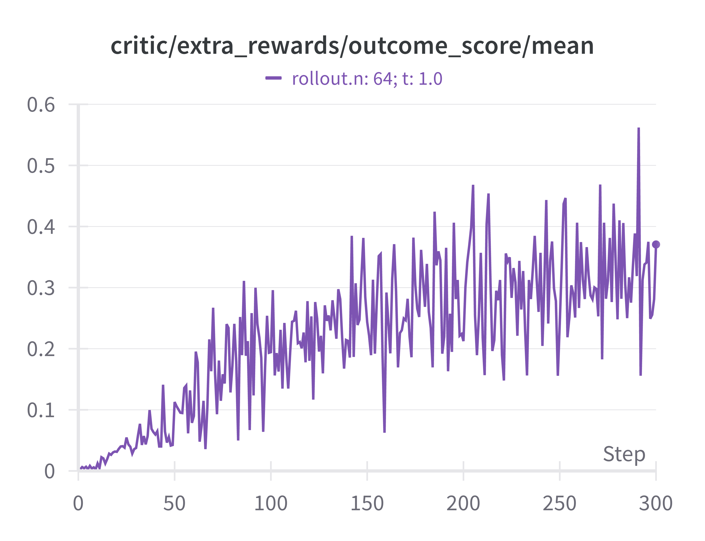
  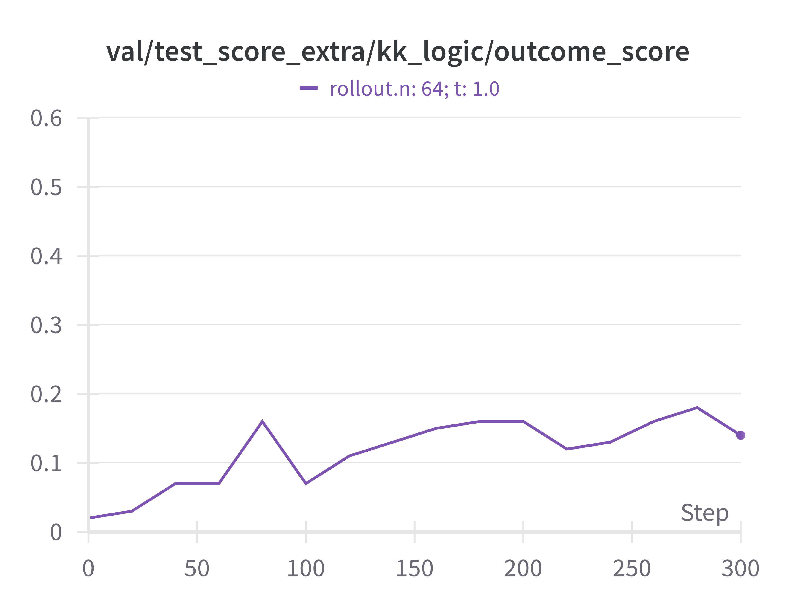
  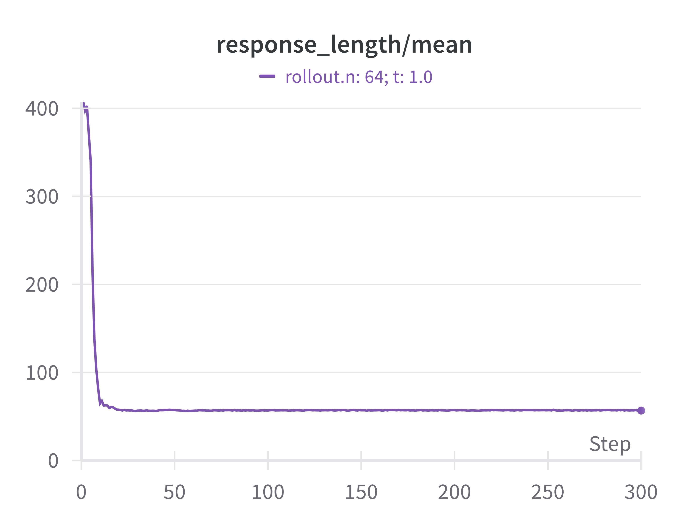
</p>

As shown in the figures above, the model overfits to the training data and fails to generalize to the validation data.  The response length converged to a low value. The model effectively hacked the format reward.

### Eliciting Reflection with Distillation for Small LMs

We then study if it is possible to distill our RL-trained Qwen2.5-7B-GRPO model into a smaller model. We chose the Qwen2.5-7B-GRPO checkpoint at step 380 as the teacher. For each data in the training set (total 900 entires), we sample 5 times from the teacher model (temperature=1.0). We perform rejection sampling and kept one of the correct samples. This results in a dataset of 899 entries. We then train the Qwen2.5-1.5B-Instruct model on this dataset with a cross-entropy loss. The training is stable. We observe a significant drop in both training and validation loss during the first epoch. We trained for 4 epochs.

<p float="left">
  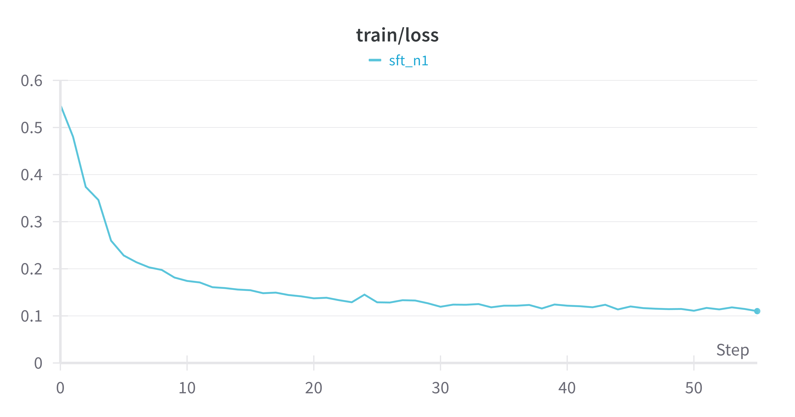
  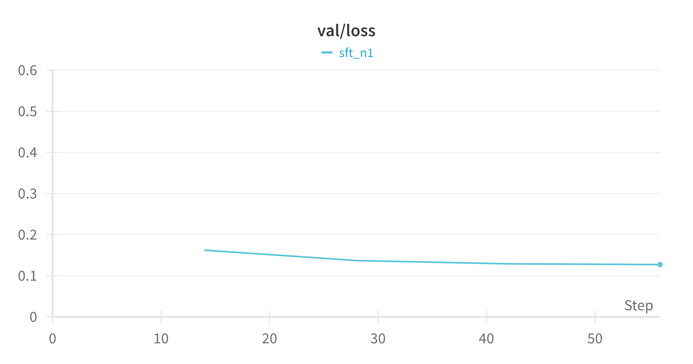
</p>

After distillation, the small distilled model exhibits the same answering behavior as the teacher model. We can observe patterns like re-evaluation and backtracking in the distilled model. It achieves a higher accuracy to baseline Instruct models (of much larger size), though it is still lower than the RL-trained model.

| **Model**                                                             | **Avg** | **2ppl** | **3ppl** | **4ppl** | **5ppl** | **6ppl** | **7ppl** | **8ppl** |
|-----------------------------------------------------------------------|---------|----------|----------|----------|----------|----------|----------|----------|
| **Qwen25-7B-Instruct-1M**                                              | 0.26 | 0.64     | 0.39     | 0.33     | 0.21     | 0.13     | 0.03     | 0.08     |
| **Qwen2.5-1.5B-Instruct-Distill (ours; 4 epoch)**                     | 0.47 | 0.56     | 0.80     | 0.72     | 0.45     | 0.35     | 0.22     | 0.16     |
| **Qwen2.5-7B-GRPO (ours; step 380)**                                  | 0.89 | 0.93     | 0.98     | 0.99     | 0.98     | 0.84     | 0.85     | 0.67     |

To our surprise, the distilled model performs much better at 3ppl problems compared to 2ppl problems that are thought to be easier. This might suggests limitations in generalization of the distilled model.

#### Reproduction Instructions

To prepare the distillation dataset, first run the distillation script to generate rollout from the teacher model.
```
bash distill_from_7b.sh
```

You may then nevigate to `notebooks/prepare_sft.ipynb` to prepare the sft dataset.

To train the distilled model, run the following script:
```
bash run_kk_sft_with_distillation_4gpus.sh
```

### Cold Starting RL on the Distilled Model

We performed GRPO on the distilled model. Since the model is smaller, we set rollout number to 32 to utilize our hardware. The temperature was set to 1.0 as we noticed in our earlier attempts that the smaller model tends to be incoherent at higher temperature. The training was stable. At step 360, the small 1.5B model reaches a performance comparable to the 7B model.

<p float="left">
  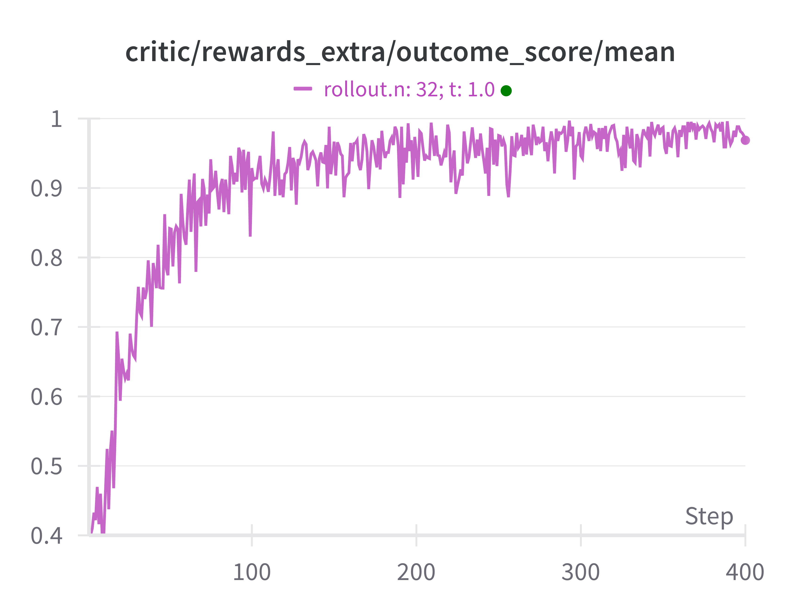
  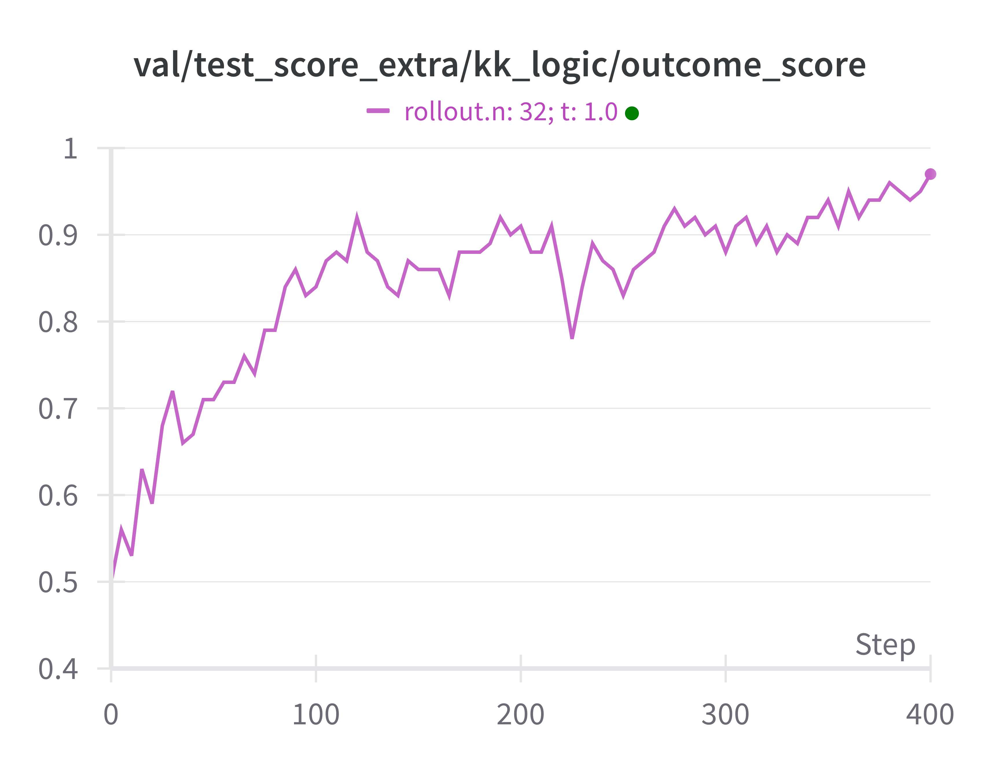
  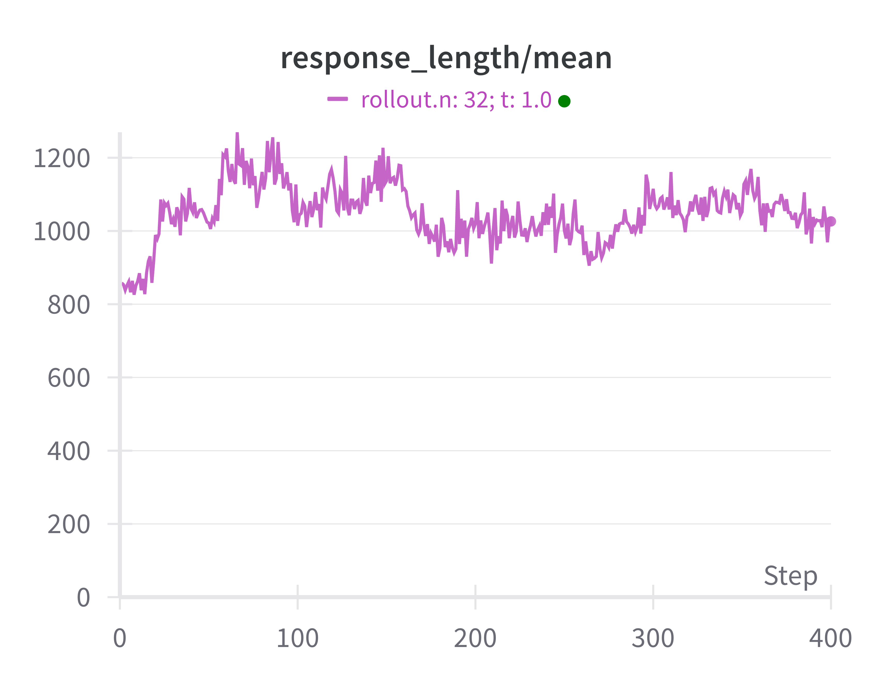
</p>

| **Model**                                                             | **Avg** | **2ppl** | **3ppl** | **4ppl** | **5ppl** | **6ppl** | **7ppl** | **8ppl** |
|-----------------------------------------------------------------------|---------|----------|----------|----------|----------|----------|----------|----------|
| **Qwen25-7B-Instruct-1M**                                              | 0.26 | 0.64     | 0.39     | 0.33     | 0.21     | 0.13     | 0.03     | 0.08     |
| **Qwen2.5-1.5B-Instruct-Distill (ours; 4 epoch)**                     | 0.47 | 0.56     | 0.80     | 0.72     | 0.45     | 0.35     | 0.22     | 0.16     |
| **Qwen2.5-7B-GRPO (ours; step 380)**                                  | 0.89 | 0.93     | 0.98     | 0.99     | 0.98     | 0.84     | 0.85     | 0.67     |
| **Qwen2.5-1.5B-Instruct-Distill-GRPO (ours; step 360)**               | 0.89 | 1.0     | 0.99     | 0.99     | 0.96     | 0.93     | 0.68     | 0.69     |

#### Reproduction Instructions

To perform RL on the distilled model, run the following script:
```
bash run_logicRL_cold_4gpus.sh
```
---

## Acknowledgements
- [Verl Framework](https://github.com/volcengine/verl)
- [TinyZero](https://github.com/Jiayi-Pan/TinyZero)
- [Logic-RL Implementation](https://github.com/Unakar/Logic-RL)
- [Knights & Knaves Dataset](https://github.com/AlphaPav/mem-kk-logic)

---

*Note: Requires modified verl framework from this repository*

*For our models, we sampled once at temperature=1.0. For baseline Instruct models, we sampled at temperature=0.0. For baseline DeepSeek models, we sampled once at temperature=0.6.*